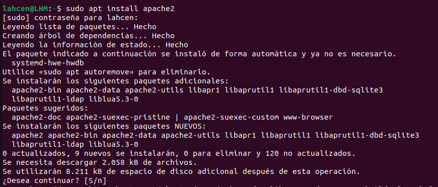
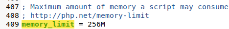

# Instalació ownCloud
## · Guia d'instalació ·

###  Instalació Apache

Per fer-ho, ens dirigiríem al nostre terminal i executarem la següent comanda:
```sh
sudo apt install apache2
```


Seguidament, desactivarem el llistat de directoris del servidor.
```sh
sudo sed -i "s/Options Indexes FollowSymLinks/Options FollowSymLinks/" /etc/apache2/apache2.conf
```


### Instalació MariaDB
Començarem instal·lant MariaDB amb la següent comanda
```sh
sudo apt-get install mariadb-server mariadb-client -y
```


A continuació configurarem la instal·lació. 
```sh
sudo mysql_secure_installation
```
Hem de deshabilitar els usuaris anonims.


Deshabilitar l'accés remot com root.


Eliminar les base de dades de prova i accés a aquestes. 


I per últim actualitzar les taules de privilegis. 


Un cop fet això reiniciarem el servidor MariaDB amb la següent comanda:
```sh
sudo systemctl restart mariadb.service
```


### Creació de la base de dades de ownCloud
Entrarem a MariaDB
```sh
sudo systemctl restart mariadb.service
```


Crearem la base de dades
```sh
CREATE DATABASE owncloud;
```


Crearem el nostre usuari amb una contrasenya, en el meu cas li he posat admin a les dues.
```sh
CREATE USER 'usuari'@'localhost' IDENTIFIED BY 'contrasenya';
``


Donarem accés a l'usuari a la base de dades que acabem de crear.
```sh
GRANT ALL ON owncloud.* TO 'usuari'@'localhost' IDENTIFIED BY 'contrasenya' WITH GRANT OPTION;
```


Apliquem els canvis i sortim.
```sh
FLUSH PRIVILEGES;
EXIT;
```


### Instal·lar PHP i els seus mòduls necessaris
Per començar, descarregarem un repositori amb les següents comandes.```sh
sudo apt-get install software-properties-common -y
```

```sh
sudo add-apt-repository ppa:ondrej/php
```


Seguidament, actualitzarem els paquets del repositori que acabem d'afegir.
```sh
sudo apt update
```


Per instal·lar el PHP i els seus mòduls, executarem les següents comandes:
```sh
sudo apt install php7.4 libapache2-mod-php7.4 php7.4-common php7.4-mbstring php7.4-xmlrpc php7.4-soap php7.4-apcu php7.4-smbclient php7.4-ldap php7.4-redis php7.4-gd php7.4-xml php7.4-intl php7.4-json php7.4-imagick php7.4-mysql php7.4-cli php7.4-mcrypt php7.4-ldap php7.4-zip php7.4-curl -y
```


Després d'instal·lar el PHP amb els seus mòduls necessaris, editarem el fitxer php.ini i canviarem els alguns valors.

Per accedir al fitxer executarem la següent comanda.
```sh
sudo gedit /etc/php/7.4/apache2/php.ini
```
Els valors que hem de canviar son:
1. file_uploads = On


2. allow_url_fopen = On


3. memory_limit = 256M


4. upload_max_filesize = 100M


5. display_errors = Off


6. date.timezone = Europe/Madrid


### Instalació ownCloud
Descarreguem l'última versió del programa i descomprimirem els fitxers, després mourem els fitxers d'ownCloud a "/var/www/html/owncloud".
```sh
cd /tmp && wget https://download.owncloud.com/server/stable/owncloud-complete-latest.zip
```


```sh
unzip owncloud-complete-latest.zip
```

```sh
sudo mv owncloud /var/www/html/owncloud/
```


Per últim, canviarem el propietari i els permisos dels directoris d'ownCloud perquè els pugui usar Apache.
```sh
sudo chown -R www-data:www-data /var/www/html/owncloud/
```
```sh
sudo chmod -R 755 /var/www/html/owncloud/
```


