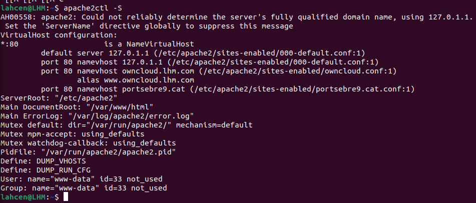
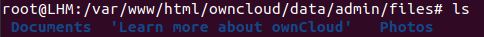
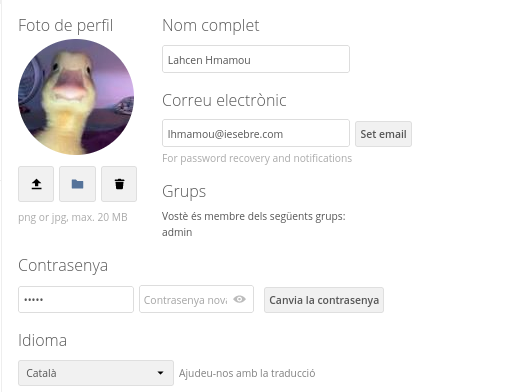
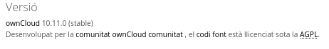

# Activitat 3


## 3.1.- Llista els Virtual Hosts d'Apache per tal de veure si owncloud.XYZ.com està habilitat amb la comanda:
```sh
apache2ctl -S
```


## 3.2.- A Owncloud podem veure que hi ha una serie de carpetes per defecte, mostra la ruta real a les tres carpetes dins de la teva MV.



## 3.3.- Al directori Learn more about owncloud hi ha informació en forma de fitxers pdf. Consulta'ls i respon aquestes preguntes:

### Quin són els tres tipus de protecció de dades que ofereix Owncloud?
- Encription in Transit
- Encryption at Rest
- End-to-End Encryption

### Fes una petita descripció de cada un d'ells.

- Encription in Transit: són dades en ruta entre l'origen i el destí

- Encryption at Rest: son les dades que s'emmagatzemen físicament en l'emmagatzematge de dades informàtiques en qualsevol forma digital

- End-to-End Encryption: és un sistema de comunicació en què només els usuaris que es comuniquen poden llegir els missatges

### Per quina raó ens recomana utilitzar Owncloud per als documents de Microsoft Office de la nostra empresa?
- Per si algun usuari esborra alguin archiu accidentalment.

### Això passa a tots els països?
- No.

### Quina és la llicència d'OWncloud Enterprise?
- Es una llicencia que nomes es pot usar a partir de 25 usaris, 12€ cada usuari al mes. Aquestes son les seves caracteristiques:

- A partir de 25 usuaris
- In situ o com a subscripció personalitzada
- Sincronització i compartició de fitxers
- Característiques addicionals d'Enterprise
- Compromís anual
- Assistència global per correu electrònic i telèfon 12 hores × 5 dies amb temps de resposta de 2 hores
- Accés al portal de clients
- Aplicacions d'escriptori i mòbil amb característiques professionals
- Marca corporativa per a aplicacions sota sol·licitud
- Llicència comercial per a mòduls principal i Enterprise


### Es poden veure videos en Streaming directament des de Owncloud?
- Sí.

### Es poden connectar directoris de Google Drive a Owncloud?
- No.

### I Dropbox?
- No.

### Compta Owncloud amb antivirus? En cas afirmatiu com es diu?
- No disposa de antivirus.

## 3.4.- Mostra els següents canvis de paràmetres d'usuari:

- Posa't una imatge d'usuari.

- Afegeix el teu mail de l'Institut.

- Canvia l'idioma a català.



- Mostra la versió d'Owncloud instal·lada.



